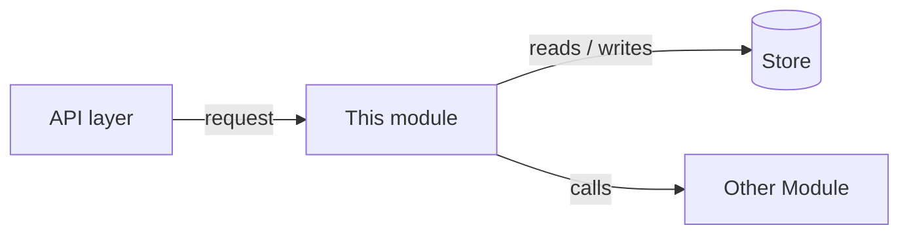

# Codebase architecture map

Maintain a living wiki describing a codebase's architecture. The **code is the
source of truth** — read it, never invent — and the wiki is the compiled,
human-readable map you own and keep in sync.

Principle: the LLM writes and maintains the map; the human reads it and asks
questions. Keep it at the architecture level — module responsibilities, interfaces,
and how things fit together — not a restatement of every function (that is what
the code and API docs are for).

## Layout

Under `architecture/` at the repo root (configurable; point elsewhere if it
clashes with generated docs):

- `architecture/index.md` — the map: a header recording the commit the map was
  last refreshed at, a short system overview, a module list with one-line
  summaries grouped by layer/package (each row noting the commit that article
  reflects), and a system-level Mermaid diagram of the main module dependencies /
  data flow (see Diagrams below).
- `architecture/<module>.md` — one article per module or subsystem.
- `architecture/log.md` — append-only log of updates.

One level of articles only. A "module" is a package/directory or a cohesive
subsystem, not a single file.

### Module article format

```markdown
# <Module name>

- Path(s): `src/foo/`, `src/foo_utils.py`
- Reflects commit: <short SHA>   Updated: YYYY-MM-DD

## Purpose
What this module is responsible for, in 1-3 sentences.

## Key files
- `path` — what it does.

## Public interface
Classes / functions / endpoints other modules or users call into.

## Depends on
- Internal: [Other Module](other-module.md)
- External: notable third-party libraries.

## Used by
Modules that depend on this one (link them).

## Data flow / interactions
What comes in, what goes out, how it talks to other modules. Add a Mermaid diagram
here when it makes the flow clearer than prose (see Diagrams below).

## Gotchas / invariants
Non-obvious constraints, footguns, assumptions.
```

Initialize on first run: if missing, create `architecture/` with `index.md`
(heading `# Architecture Map`) and `log.md` (heading `# Architecture Log`).
Never overwrite existing files.

## Recording the commit SHA

Every write records the commit the repo was at, so you can tell which state of the
codebase the content was built from. Capture it once at the start of a Map or
Verify run:

```bash
git rev-parse --short HEAD     # e.g. a1b2c3d
git status --porcelain         # if non-empty, the working tree is dirty
```

If the working tree has uncommitted changes, append `-dirty` (e.g. `a1b2c3d-dirty`)
so the SHA is not mistaken for a clean checkout; `git describe --always --dirty` is
a one-shot equivalent. Record the same value in three places:

- each article's **Reflects commit** field — the state that article was written from;
- the **index header**, e.g. `Map reflects commit: <SHA> — YYYY-MM-DD`, set to the
  commit of the most recent Map run;
- every **log entry** (see below).

If the project is not a git checkout, use `unknown` and note it.

## Diagrams (Mermaid)

Use Mermaid so diagrams live inside the markdown, stay diffable, and render on
GitHub/GitLab and in most wiki viewers. Put each diagram in a fenced ` ```mermaid `
block. (If the wiki is published through Sphinx, enable a Mermaid extension such as
`sphinxcontrib-mermaid`; MkDocs needs the `mermaid2` plugin.)

Where diagrams go:
- **index.md** — one system-level diagram: modules as nodes, dependencies or data
  flow as edges, grouped into layers with `subgraph`. This is the visual map.
- **Module article** — a focused diagram for that module: its data flow, an
  important call sequence, or its lifecycle. Prefer one clear diagram over several.

Pick the type by what you are showing:
- **Module/dependency map or data flow** → `flowchart` (label edges with what flows).
- **Runtime interaction across components** → `sequenceDiagram`.
- **Lifecycle of a stateful component** → `stateDiagram-v2`.
- **Type/class relationships**, when they clarify → `classDiagram`.

Grounding and legibility (same discipline as the prose):
- Nodes are real modules/files/symbols; edges are real dependencies, calls, or data
  flows. Do not invent structure to make a diagram look complete.
- Keep node IDs stable and human-readable so diffs stay small as the code changes.
- Stay at the architecture level. If a diagram exceeds ~15-20 nodes, scope it to one
  concern or split it rather than drawing the whole repo at once.

Example — module data flow in an article:



## Scope (what to read)

Keep the scan cheap and focused on the real codebase: read only committed source,
and never walk build or generated output.

- Enumerate files with `git ls-files` instead of walking the filesystem. It lists
  exactly the tracked files and automatically excludes untracked files and anything
  in `.gitignore` (build dirs, caches, artifacts). For strictly the state committed
  at HEAD — excluding staged-but-uncommitted files — use
  `git ls-tree -r --name-only HEAD`.
- Skip build/generated/vendored trees even when a project commits them: `build/`,
  `dist/`, `out/`, `target/`, `node_modules/`, `.venv/`, `venv/`, `__pycache__/`,
  `*.egg-info/`, `site-packages/`, minified assets, generated code, large data
  files, lockfiles, and binaries — none of these describe architecture.
- Do not read every file. Per module, read the entry points and public interface
  (`__init__.py`, headers, `main`, service entrypoints) and sample a few
  representative implementation files; skip tests/fixtures unless they are the
  clearest description of behavior. Use `git ls-files <dir>` to list a module's
  files, then open only what you need.
- If the project is not a git checkout, fall back to a filesystem walk but apply
  the same ignore list and honor `.gitignore`.

## Map (build / refresh)

Scan the repo — or a named module — and create or update articles.

1. Identify modules from the directory/package structure and entry points
   (`pyproject.toml`, `CMakeLists.txt`, `__init__.py`, `main`, service configs).
   List files with `git ls-files` and stay within Scope — do not walk the tree.
2. Read enough of the actual code to describe each module accurately. **Every
   claim must trace to a real file or symbol** — read the code rather than guess;
   if you cannot verify something, say so instead of inventing it.
3. Write/update the article in the format above, including a Mermaid diagram where
   it aids understanding (see Diagrams). Record the commit the article reflects
   (see Recording the commit SHA) and today's date.
4. Cascade: if a module's public interface, dependencies, or responsibilities
   changed, update the "Depends on" / "Used by" sections of affected articles and
   the index. Refresh the Updated date on every article you materially change.
5. Update `index.md` — refresh its `Map reflects commit` header, the module list,
   summaries, and the system-level Mermaid diagram — and append to `log.md`:
   ```
   ## [YYYY-MM-DD] map | <SHA> | <module(s) touched>
   ```

## Query

Answer architecture questions from the wiki.

1. Read `index.md` to locate relevant articles, then read those articles.
2. Prefer wiki content; if it is thin or possibly stale, fall back to reading the
   code and note that you did so.
3. Cite articles and the underlying files, e.g. `[Module](architecture/module.md)`
   and `src/foo/bar.py`. Answer in the conversation; do not write files unless asked.

## Verify (lint against the code)

Check the map against the real codebase (enumerate files with `git ls-files`; see
Scope).

Auto-fix when unambiguous:
- Article references a path/symbol that moved → update it if there is exactly one
  clear match; otherwise report.
- A module directory exists with no article → add a stub entry to the index.
- An index entry points to a missing article → mark `[MISSING]`; do not delete.

Report only (needs judgment):
- Articles whose recorded commit is behind `HEAD` **and** whose paths changed since
  → flag as possibly stale. Check with
  `git log --oneline <recorded SHA>..HEAD -- <module paths>` (non-empty = changed).
- Described modules/interfaces that no longer exist, or new ones undocumented.
- Mermaid diagram nodes referencing modules/files that no longer exist, or missing
  edges for dependencies now present in the code.
- Contradictions between articles; missing cross-references.

Append to `log.md`:
```
## [YYYY-MM-DD] verify | <SHA> | <N> issues, <M> auto-fixed
```

## Conventions

- Standard markdown with relative links between articles.
- Update the map in the same PR that changes a module's structure or interface —
  the map is only useful if it stays trustworthy.